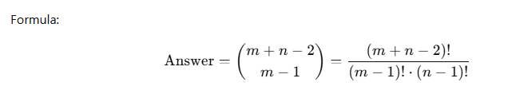

# 62. Unique Paths

There is a robot on an `m x n` grid. The robot is initially located at the **top-left corner** (i.e., `grid[0][0]`). The robot tries to move to the **bottom-right corner** (i.e., `grid[m - 1][n - 1]`). The robot can only move either down or right at any point in time.

Given the two integers `m` and `n`, return _the number of possible unique paths that the robot can take to reach the bottom-right corner_.

The test cases are generated so that the answer will be less than or equal to `2 * 10`<sup>`9`</sup>.

&#x20;

**Example 1:**


<pre><code><strong>Input: m = 3, n = 7
</strong><strong>Output: 28
</strong></code></pre>

**Example 2:**

<pre><code><strong>Input: m = 3, n = 2
</strong><strong>Output: 3
</strong><strong>Explanation: From the top-left corner, there are a total of 3 ways to reach the bottom-right corner:
</strong>1. Right -> Down -> Down
2. Down -> Down -> Right
3. Down -> Right -> Down
</code></pre>

&#x20;

**Constraints:**

* `1 <= m, n <= 100`


## Solution.

### Recursive

```cpp
class Solution {
public:
    int uniquePaths(int m, int n) {
        // this is the recusive solution
        //base conditions
        if(m-1==0 && n-1==0) return 1;
        if(m-1<0 || n-1<0) return 0;

        int up = uniquePaths(m-1,n);
        int left = uniquePaths(m,n-1);

        return up + left;
    }
};
```

#### Complexity

* ⏱ Time = `O(2^(m+n))`
* 🛢 Space = `O(m+n)`


### Recursion + Memoisation (Top-Down DP)

```cpp
class Solution {
public:
    int uniquePaths(int m, int n) {
        // this is the recursion + memoisation (top down dp) solution
        vector<int> filler(n,-1);
        vector<vector<int>> grid(m,filler);
        return up(m-1,n-1,grid);
    }

    int up(int m, int n, vector<vector<int>>& grid){
        //base conditions
        if(m==0 && n==0) return 1;
        if(m<0 || n<0) return 0;
        if(grid[m][n]!=-1) return grid[m][n];

        int upp = up(m-1,n,grid);
        int left = up(m,n-1,grid);
        grid[m][n] = upp + left;

        return grid[m][n];
    }
};
```

#### Complexity

* ⏱ **Time:** `O(m*n)` (every subproblem solved once)
* 💾 **Space:** `O(m*n)` (dp table + recursion stack)


### Tabulation (Bottom-Up DP)

```cpp
class Solution {
public:
    int uniquePaths(int m, int n) {
        // this is the tabulation(bottom up) solution with no space optimisation
        vector<int> filler(n,0);
        vector<vector<int>> grid(m,filler);
        //now we have mxn grid filled with 0s
        for(int i = 0; i<m; i++){
            for(int j = 0; j<n; j++){
                if (i == 0 && j == 0) {
                    grid[i][j] = 1;  // starting cell
                } else {
                    int up   = (i > 0) ? grid[i-1][j] : 0;
                    int left = (j > 0) ? grid[i][j-1] : 0;
                    grid[i][j] = up + left;
                }
            }
        }

        return grid[m-1][n-1];
    }
};
```

#### Complexity

* ⏱ **Time:** `O(m*n)`
* 💾 **Space:** `O(m*n)`


### Tabulation (Bottom-Up DP) Space optimised (2-row)

```cpp
class Solution {
public:
    int uniquePaths(int m, int n) {
        // this is the tabulation(bottom up) solution (2 row space optimisation);

        vector<int> above(n,0);
        vector<int> thisrow(n,0);

        for(int i=0; i<m; i++){
            for(int j=0; j<n; j++){
                if(i==0 && j==0){
                    thisrow[j] = 1;
                }
                else{
                    int up = (i>0) ? above[j] : 0;
                    int left = (j>0) ? thisrow[j-1] : 0;

                    thisrow[j]=up + left;
                }
            }
            above=thisrow;
        }

        return thisrow[n-1];
    }
};
```

#### Complexity

* ⏱ **Time:** `O(m*n)`
* 💾 **Space:** `O(n)`


### Tabulation (Bottom-Up DP) Space optimised (1-row)

```cpp
int uniquePaths(int m, int n) {
    vector<int> dp(n, 1); // first row = all 1
    for (int i = 1; i < m; i++) {
        for (int j = 1; j < n; j++) {
            dp[j] = dp[j] + dp[j-1]; 
            // dp[j] = from top (old dp[j]) + from left (dp[j-1])
        }
    }
    return dp[n-1];
}
```

#### Complexity

* ⏱ **Time:** `O(m*n)`
* 💾 **Space:** `O(n)`


### Combinatorics

To reach `(m-1, n-1)`:

* You must move **(m-1) downs** and **(n-1) rights** in some order.
* Total moves = `(m-1 + n-1) = m+n-2`.
* Choose which of those are downs (or rights).

<figure><figcaption></figcaption></figure>

```cpp
long long uniquePaths(int m, int n) {
    int N = m + n - 2;
    int r = min(m-1, n-1); // choose smaller for efficiency
    long long ans = 1;
    for (int i = 1; i <= r; i++) {
        ans = ans * (N - r + i) / i;
    }
    return ans;
}
```

#### Complexity

* ⏱ **Time:** `O(min(m,n))`
* 💾 **Space:** `O(1)`
